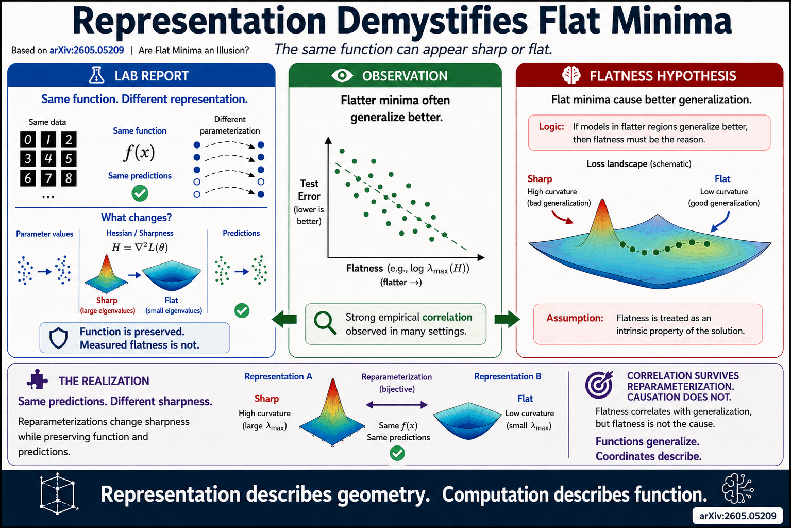

# Representation Demystifies Flat Minima

<p align="center">
  
</p>

**Notebooks and experiments inspired by arXiv:2605.05209**, exploring flat minima, Hessian geometry, reparameterization, and why representation may matter more than sharpness when explaining neural network generalization.

## Core Question

Classical deep learning theory often associates **flat minima** with better generalization.

But what happens when the same computation is expressed in a different parameterization?

If sharpness changes while predictions remain identical, is sharpness measuring the computation—or merely its representation?

This repository builds a sequence of toy experiments investigating that question.

---

## Engineering Statement

> Curvature measures geometry.
>
> Geometry depends on representation.
>
> Computation survives representation.
>
> Scientific explanations should identify what survives.

---

## Repository Roadmap

| Notebook | Focus                                | Colab |
| -------- | ------------------------------------ | ----- |
| 00       | Context and paper overview           | <a href="https://colab.research.google.com/github/thinkthoughts/flat-minima-representation/blob/main/notebooks/00_context.ipynb">📓</a>  |
| 07       | Classical flat-minima hypothesis     | <a href="https://colab.research.google.com/github/thinkthoughts/flat-minima-representation/blob/main/notebooks/07_flat_vs_sharp.ipynb">📓</a>    |
| 13       | Hessian geometry and curvature       | <a href="https://colab.research.google.com/github/thinkthoughts/flat-minima-representation/blob/main/notebooks/13_hessian_geometry.ipynb">📓</a>    |
| 17       | Reparameterization changes sharpness | <a href="https://colab.research.google.com/github/thinkthoughts/flat-minima-representation/blob/main/notebooks/17_reparameterization.ipynb">📓</a>    |
| 23       | Correlation versus causation         | <a href="https://colab.research.google.com/github/thinkthoughts/flat-minima-representation/blob/main/notebooks/23_correlation_vs_causation.ipynb">📓</a>    |
| 29       | Representation matters               | <a href="https://colab.research.google.com/github/thinkthoughts/flat-minima-representation/blob/main/notebooks/29_representation_matters.ipynb">📓</a>    |
| 37       | Conclusions and surviving properties | <a href="https://colab.research.google.com/github/thinkthoughts/flat-minima-representation/blob/main/notebooks/37_conclusions.ipynb">📓</a>    |

---


## Notebook Sequence

### 00 — Context

Introduces the paper, flat-minima literature, and the central question:

> What properties remain meaningful when representations change?

---

### 07 — Classical Flat-Minima Hypothesis

Builds intuition for flat and sharp minima.

Key ideas:

* Flat minima correspond to smaller curvature.
* Sharp minima correspond to larger curvature.
* Hessians measure local curvature.
* Classical hypothesis:

  Flat minima → robustness → better generalization.

---

### 13 — Hessian Geometry

Introduces Hessians as geometric measurements.

Experiments visualize:

* Curvature families
* Eigenvalues
* Eigenvectors
* Anisotropic versus isotropic bowls

Key takeaway:

> Flatness is a geometric property measured through Hessian curvature.

---

### 17 — Reparameterization

Shows that equivalent functions can have very different measured sharpness.

Experiments demonstrate:

* Same input-output behavior
* Different parameter coordinates
* Different Hessian values

Key takeaway:

> Measured sharpness depends on representation.

---

### 23 — Correlation versus Causation

Explores relationships between:

* Sharpness
* Test error
* Reparameterized coordinates

Key takeaway:

> Correlations involving sharpness may weaken or disappear after coordinate changes.

---

### 29 — Representation Matters

Synthesizes previous results.

Distinguishes:

**Computation**

* Function
* Predictions
* Test error

from

**Representation**

* Coordinates
* Parameter norms
* Hessian sharpness
* Local curvature

Key takeaway:

> Computation survives representation changes. Geometry may not.

---

### 37 — Conclusions

Summarizes the repository.

Central result:

> Same computation.
>
> Different geometry.

Future question:

> Can we build representation-invariant measures of generalization?

---

## Figures

Generated figures are saved to:

```text
figures/
```

Structured outputs are saved to:

```text
results/
```

Each notebook also exports downloadable ZIP archives containing generated figures and summaries.

---

## Paper

**Representation Demystifies Flat Minima**

Source paper:

* arXiv:2605.05209

This repository is an educational and computational companion exploring the paper's ideas through simplified experiments and visualizations.

---

## Citation

If you use these notebooks, please cite the original paper and link back to this repository.
